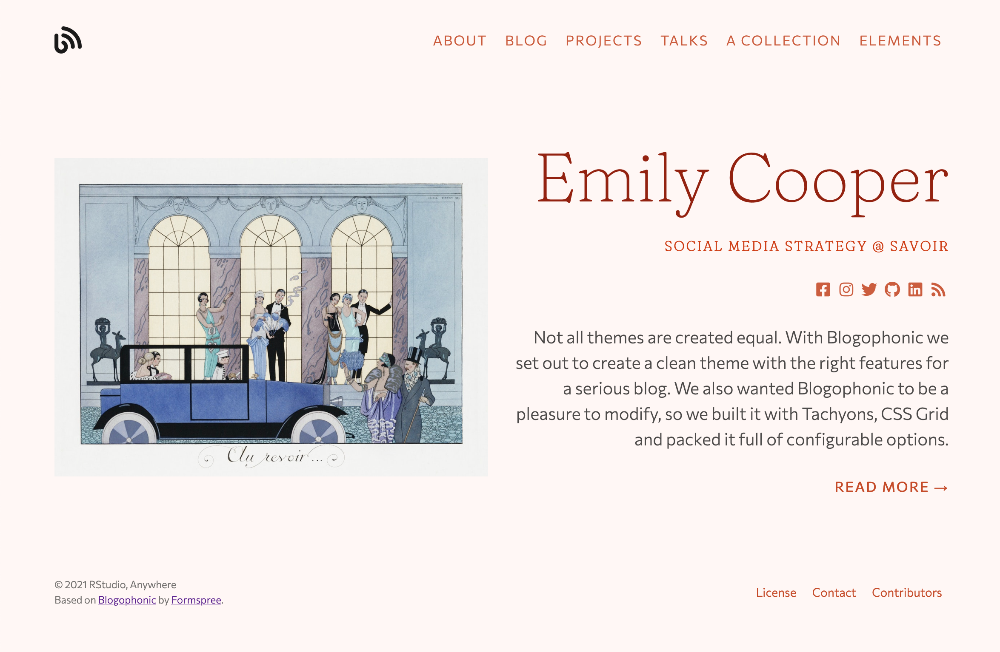

You can totally customize your site's theme colors within minutes of
creating a new site. Read on to find out how, and decide which of the 
three options meets your needs.

## Use a color theme

Hugo Apéro includes 8 built-in color themes that work "out of the box." 
This means you can use a color theme to quickly customize the look of your site
without needing to write any CSS. You can select the color theme in your `config.toml` file. Scroll down to find:

```toml
[params]
  <!--snip snip-->
  # use a built-in color theme
  # one of: forest / grayscale / peach / plum /
  #         poppy / sky / violet / water
  theme = ""
```

Type one of the options like `"peach"` inside the quotation marks. If you have a Hugo server started (i.e., by using `blogdown::serve_site()`), when you save the `config.toml` file, your site preview will immediately and automatically update with your new color theme. For example, let's choose `"peach"`!

```toml
[params]
  <!--snip snip-->
  # use a built-in color theme
  # one of: forest / grayscale / peach / plum /
  #         poppy / sky / violet / water
  theme = "peach"
```

You should see:



If you select a theme that isn't one of the available options (like `"pecan"`), 
you should see an error message print to your viewer pane in the RStudio IDE:

```bash
Selected theme 'pecan' is not one of the options.
```

All of the color themes were designed to meet [WCAG 2.0 level AA requirements](https://webaim.org/articles/contrast/) for contrast ratios.

## Use Tachyons named colors

This theme uses [Tachyons](https://tachyons.io), a design system that allows you 
to design gorgeous interfaces in the browser with little effort.


We've leveraged the [accessible color
combinations](https://tachyons.io/docs/themes/skins/) included with Tachyons to
offer an easy way for you to setup your site using your favorite colors. Here are the steps:

+ Create an `assets/` folder in the root of your website project (don't add it to your `themes/` directory!).

+ Create a `.scss` file in the new `assets/` folder.

+ Copy the code below for a full set of color parameters giving you control over the theme color scheme. For an option like `siteBgColor`, for example, you can type one of the predefined color names from Tachyons and save the file. Use only color names as shown in the "Color Palette" section of <httpss://tachyons.io/docs/themes/skins/>.

```scss
// basic color options: use only color names as shown in the
// "Color Palette" section of httpss://tachyons.io/docs/themes/skins/
$siteBgColor: "near-white" ;
$sidebarBgColor: "light-gray" ;
$textColor: "dark-gray" ;
$sidebarTextColor: "mid-gray" ;
$headlineColor: "dark-pink" ;
$headingColor: "near-black" ;
$bodyLinkColor: "blue" ;
$navLinkColor: "near-black" ;
$sidebarLinkColor: "near-black" ;
$footerTextColor: "silver" ;
$buttonTextColor: "near-white" ;
$buttonBgColor: "black" ;
$buttonHoverTextColor: "white" ;
$buttonHoverBgColor: "blue" ;
$borderColor: "moon-gray" ;
```

Two last steps- back in your `config.toml` file:

1. Leave the theme blank (so `theme = ""` with empty quotes) in your `config.toml` file.

1. Add the name of your theme file (minus the `.scss` extension) that you added to `assets/` as the `custom_theme`.

Your final `config.toml` would look something like this:

```toml
[params]
  <!--snip snip-->
  # use a built-in color theme
  # one of: forest / grayscale / peach / plum /
  #         poppy / sky / violet / water 
  theme = ""
  
  # or, leave theme empty & make your own palette
  # see docs at https://hugo-apero.netlify.app/blog/color-themes/
  # the custom scss file must be in the assets/ folder
  # add the filename name here, without extension
  # to use hex colors instead of named tachyons colors, include "hex" in filename
  custom_theme = "named-colors" 
```

## Bring your own hex codes

Let's say you have a style guide to follow and `washed-blue` just won't cut the
mustard. There is a bypass of these
predefined colors built in, you just need to do *one very special extra step*. Follow the steps above for using named Tachyons colors, but then, add `hex` anywhere in the filename for your custom `.scss` (for example, you may name this file `hex-colors.scss`). If you include `hex` in the filename, you get to assign your own HEX codes, like this:

```scss
// set custom hex colors
$siteBgColorCustom: #e3e3da;
$sidebarBgColorCustom: #dbdbd2;
$textColorCustom: #666260;
$sidebarTextColorCustom: #666260;
$headlineColorCustom: #103742;
$headingColorCustom: #103742;
$bodyLinkColorCustom: #c4001a;
$navLinkColorCustom: #c4001a;
$sidebarLinkColorCustom: #c4001a;
$footerTextColorCustom: #918f8d;
$buttonTextColorCustom: #f7f7f4;
$buttonHoverTextColorCustom: #f9f9f8;
$buttonBgColorCustom: #103742;
$buttonHoverBgColorCustom: #c4001a;
$borderColorCustom: #c4beb9;
```

After adding the name of your theme file (minus the `.scss` extension) that you added to `assets/` as the `custom_theme`, your final `config.toml` would look something like this:

```toml
[params]
  <!--snip snip-->
  # use a built-in color theme
  # one of: forest / grayscale / peach / plum /
  #         poppy / sky / violet / water 
  theme = ""
  
  # or, leave theme empty & make your own palette
  # see docs at https://hugo-apero.netlify.app/blog/color-themes/
  # the custom scss file must be in the assets/ folder
  # add the filename name here, without extension
  # to use hex colors instead of named tachyons colors, include "hex" in filename
  custom_theme = "hex-colors" 
```

