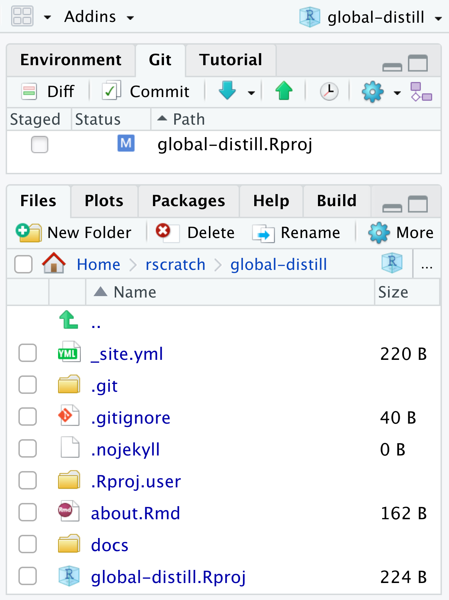
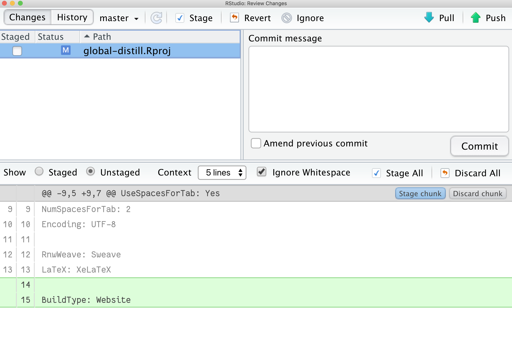

## Pre-requisites

First, make sure you have the latest version of the distill package installed from CRAN:

    install.packages("distill")

Restart your R session. If you use RStudio, use the menu item *Session \> Restart R* or the associated keyboard shortcut:

-   <kbd>Ctrl + Shift + F10</kbd> (Windows and Linux) or
-   <kbd>Command + Shift + F10</kbd> (Mac OS).

```r
packageVersion("distill")
# [1] ‘1.2’ 
```

## Create GitHub repo

Online.

## Clone GitHub repo

    usethis::create_from_github("https://github.com/apreshill/global-distill.git")

:sparkles: Commit & Push! :sparkles:

You should be committing these files:

-   `*.Rproj`

-   `.gitignore`

## Create a new distill site

Inside your current distill project, use the R console:

    library(distill)

Let's start with a simple website:

    create_website(dir = ".", title = "global-distill", gh_pages = TRUE)

Now, let's commit all these new files and push to GitHub.

## Build site

Please *close* the RStudio IDE and re-open it. Look in your Git pane, you should see a single file has changed:

<center>



</center>

Let's look at the diff:

<center>



</center>

Let's go ahead and commit this file before we start adding to our site.

You should see:


## Add a postcard

Docs: <https://rstudio.github.io/distill/website.html#postcards>

Now, delete your `about.Rmd` (trust me!). We'll create a new one with the postcards package.

```
create_article(file = "about",         # future name of .Rmd file
               template = "jolla",    # name of template
               package = "postcards")
```

[Reminder: templates]( "Postcards templates")


## Site navigation

`_site.yml`

## Theme

Docs: <https://rstudio.github.io/distill/website.html#theming>

    distill::create_theme("apreshill")

Remember your `_site.yml` file? Add the theme line there:

``` {.yaml}
name: "Alison Hill"
title: "Personal website of Dr. Alison Hill"
description: |
  This is my personal website.
output_dir: "docs"
theme: apreshill.css
navbar:
  right:
    - text: "Home"
      href: index.html
    - text: "About"
      href: about.html
output: distill::distill_article
```

## Publish a distill site

Easy:

-   Push, publish to GitHub pages <https://docs.github.com/en/github/working-with-github-pages/creating-a-github-pages-site#creating-your-site>

Medium:

```
> use_github_pages(branch = "main", path = "/docs")
✓ Setting active project to '/Users/alison/rscratch/global-distill'
✓ Activating GitHub Pages for 'apreshill/global-distill'
✓ GitHub Pages is publishing from:
● URL: 'https://apreshill.github.io/global-distill/'
● Branch: 'main'
● Path: '/docs'
```
